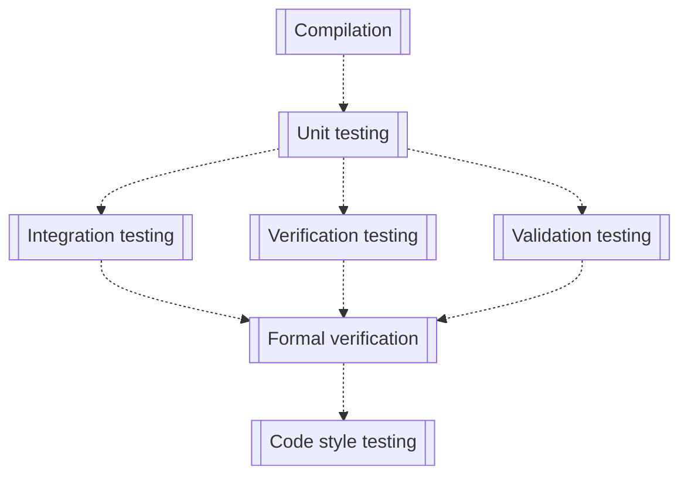

!!! important
    Testing should be automated to the greatest extent possible. It should be triggered automatically on every push to provide immediate feedback, with shorter tests running first so that a failure stops the testing pipeline as soon as possible.
    
The testing pipeline should be organized as follows:

## Unit testing

Unit tests check specific functions and provide a significant amount of protection from coding errors. In order to generate maximum value, unit tests will provide:

+ Full path coverage of each tested function
+ Variable value checks
+ Loop checking to ensure exit criteria can always be met

If property testing or formal verification is not a possibility for this project, the following additional tests must be written:

+ Input checks: low, high, and mid-range, as well as high and low out of range values, and any edge condition values
+ Output checking: at worst-case inputs, outputs should always be valid / correct

## Integration testing

At a minimum, integration tests exercise interfaces to other software, hardware, and subsystems. They provide indication that the API or ICD has changed.

## Verification testing

Verification testing consists in proving compliance with the requirements and the detailed design. Verification may be determined by test, analysis, demonstration, or inspection or a combination thereof. The Lead duly inspects the testing results of the automated pipeline, assuming that verification testing is done there.

## Validation testing

Validation testing is the process of showing proof that the software accomplishes the intended purpose based on stakeholder expectations and the CONOPS. This may be determined by a combination of test, analysis, demonstration, and inspection. The lead, with the optional support of a stakeholder, will perform or duly inspect this testing. Examples include running an end-to-end scenario and checking that a specific set of outputs is met given some inputs, and that these outputs match the stakeholder needs.

## Formal verification

!!! quote 
    Formal verification is the process of mathematically checking that the behavior of a system, described using a formal model, satisfies a given property, also described using a formal model.
    
    [_Design of Embedded Systems: Formal Models, Validation, and Synthesis_](https://doi.org/10.1016/B978-155860702-6/50009-0), Edwards et al.

Formal verification and property testing (or "hypothesis testing") is the process of _proving_ that the function will not fail under a set of conditions. In Rust, the [kani model checker](https://model-checking.github.io/kani/) is an example of formal verification: at compilation time, the Kani model will go through all possible inputs to a function given the input parameter types, and ensure that the function does not fail.

*[CONOPS]: Concept of Operations