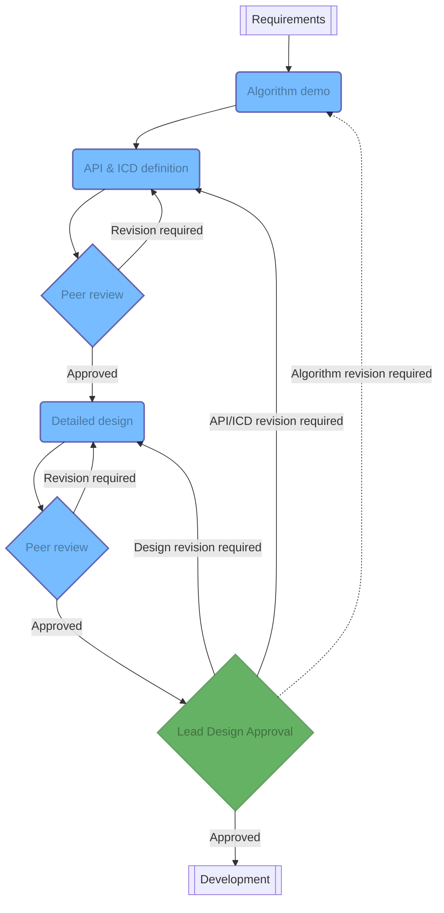
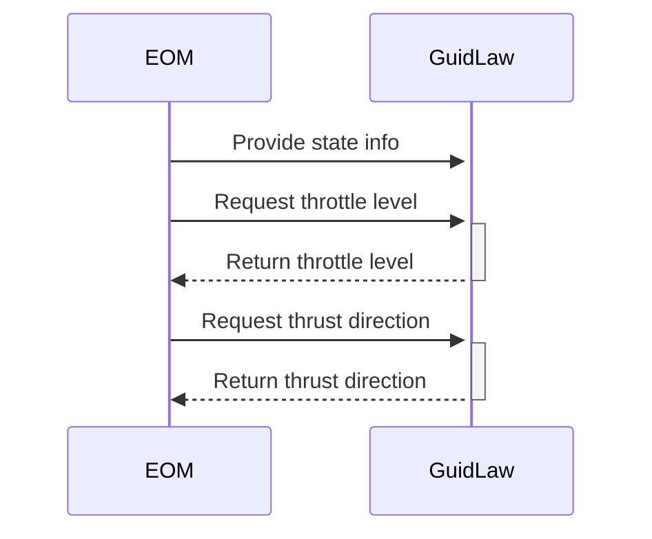

The design is arguably one of the most important parts of the quality assurance process. Once a design has been approved and implemented, it will be hard to change. **A bad design may lead to severe technical debt. A poorly documented design may lead to an engineer being a single point of knowledge.**

The design phase is broken down into four parts.

## Algorithm demonstration

!!! note
    If the requirement is unrelated to GNC or is a bug fix this step can be skipped. If the requirement at hand does not involve a novel algorithm, then this step may simply provide a reference to the algorithm being used.

Most GNC work is related to the development and implementation of specific algorithms, such as guidance laws. It is difficult to properly define all of the inputs and outputs of a given GNC algorithm only from a concept in one's mind or from a publication. Moreover, other engineers on the team may think of edge cases of a given algorithm that the developing engineer may not think of.

Hence, **the first part of the design is to implement a proof of concept of the algorithm to be developed.** This proof of concept may live in isolation from the rest of the code if exposing its interface leads to an easier demonstration of the algorithm.

## API and ICD definition
The Interface Control Documents (ICDs) are the contracts established between the sides of each interface. If these interfaces live at the scope boundary with the stakeholder, then these are considered requirements and will be developed along with all other program requirements to ensure a consistent understanding between all relevant parties as well as to ensure appropriate testing is performed.

If these are not interfaces at the project scope boundary, then the interface is considered an Application Programming Interface and is designed to only be usable from within the same project or even within the same code base.

**The second part of the design consists in defining the interface between the changes to introduce and the software or hardware.** The ICD should be versioned for traceability, preferably in a control system that allows for differences to be easily inspected (e.g. `git`). The exact version of the ICD used should be referenced in the code: this enables any auditor to quickly determine whether a piece of functionality adheres to the latest ICD version.

## High level architecture
The high-level architecture captures the block definition diagram of the overall product, the ownership of each block, the sequence diagrams of the core functionality of the software project, and the high-level details expected to inform the development.

**After the approval of the API and ICD, and prior to the detailed design, the engineer shall add the functionality being worked on to the high level architecture document.** This will ensure proper documentation from the start along with an understanding of how this functionality fits into the large picture.

## Detailed design

**The Detailed Design is a living document which refines the initial design through iterations and captures any remaining architectural definitions**. The Detailed Design Document describes the algorithms for each function and provide insights into trades studies as appendices for foundational design decisions. This document may be partially or in totality automatically generated from code.

Expected attributes captured in the Detailed Design may include the following:

+ Operating System
+ Programming Languages
+ Interfaces to hardware, other software, and definitions for off-nominal behavior
+ Approaches to standard spacecraft software architecture items
+ Time systems used in the software (e.g. TAI or UTC)
+ Logging capabilities for engineers running the software or even operations team
+ Commanding and telemetry rates
+ Onboard messaging and sequencing capabilities for flight software where applicable
+ Fault detection, isolation and recovery (FDIR) management
+ Use of standard libraries, drivers, etc.

## Example: guidance laws in Nyx
In Nyx, [guidance laws](https://docs.rs/nyx-space/latest/nyx_space/dynamics/guidance/trait.GuidanceLaw.html) enable engineers to define custom guidance laws. Let's look at how such an addition would flow through the design process.

### Algorithm demonstration
Guidance laws are a _trait_ (the equivalent of an abstract class in C++), so one can't exactly develop a generic definition of a guidance law without a specific example implementation. This is acceptable by the QA policy since the topic is so generic. In this example, the algorithm demonstration will be a simple anti-velocity thrusting guidance law and will fit directly into the 3-DOF code, in its own separate branch.

### API definition
We're looking for the guidance laws to only be accessible within the Nyx software, so the scope stops at the API level. Moreover, since it only lives in the code, it is automatically assigned a version corresponding to the git hash.

To define the API, engineers ought to ask themselves **what are the inputs and outputs of this functionality and what part of the code will call this?**

In the case of an anti-velocity guidance law, we will need at a minimum:

+ The current spacecraft state, including its orbit, so we can compute the anti-velocity unit vector;
+ A flag specifying whether or not to thrust at the current phasing angle of the orbit.

We also know that the guidance law will be called from the equations of motion of the overall simulation. We expect that just after the guidance laws are called, the EOM will check that the vehicle can thrust (e.g. does it have any fuel remaining), what percentage of fuel it should be decrementing for the current simulation step, and the direction of the burn (so as to compute how that affects the position of the spacecraft). These are the outputs: direction and throttle percentage.

### High level design

At this stage, we can have the following basic sequence diagram.

### Detailed design

As shown in the API documentation, [guidance laws](https://docs.rs/nyx-space/latest/nyx_space/dynamics/guidance/trait.GuidanceLaw.html) are actually a notch more complicated than what this high level design expected.

In fact, during the development of additional guidance laws, it became evident that the notion of "achievement" of a guidance law was important, and so was the preparation of a guidance law for the next call (e.g. to move onto a subsequent objective). This is OK: **the detailed design document is updated throughout the development of a product to account for changes.**

*[API]: Application Programming Interface
*[ICD]: Interface Control Document
*[QA]: Quality Assurance
*[GNC]: Guidance, Navigation, and Control
*[FSW]: Flight Software
*[technical debt]: "Technical debt is the implied cost of additional rework caused by choosing an easy solution now instead of using a better approach that would take longer." - Wikipedia (https://en.wikipedia.org/w/index.php?title=Technical_debt&oldid=1097653969)
*[3-DOF]: Three degrees of freedom simulation
*[EOM]: equations of motion
*[FDIR]: Fault detection, isolation and recovery