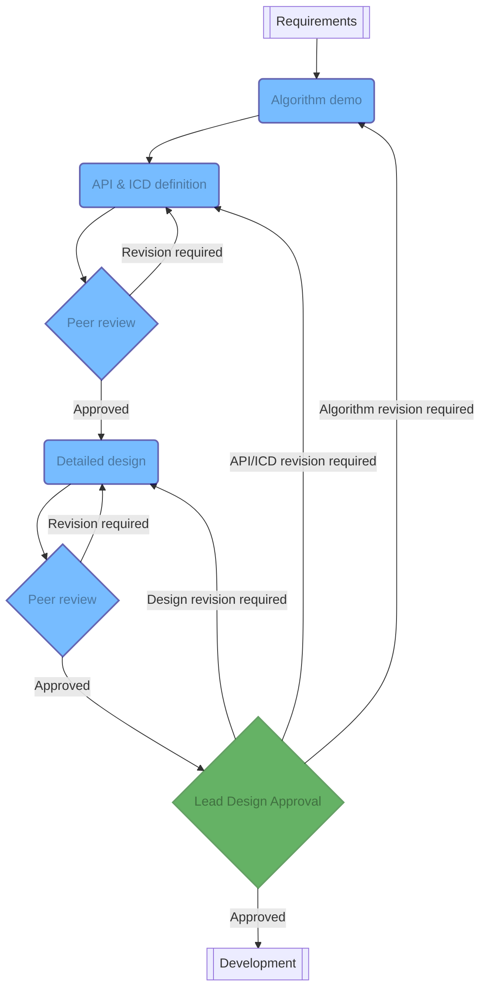

The design is arguably one of the most important parts of the quality assurance process. Once a design has been approved and implemented, it will be hard to change. A bad design may lead to severe technical debt. A poorly documented design may lead to an engineer being a single point of truth knowledge to the whole program.

The design is broken down into four parts.

## Algorithm demonstration

Most GNC work is related to the development and implementation of specific algorithms, such as guidance laws. It is difficult to properly define all of the inputs and outputs of a given GNC algorithm only from a concept in one's mind or from a paper. Moreover, other engineers on the team may think of edge cases of a given algorithm that the developing engineer may not think of.

Hence, the first part of the design is to implement a proof of concept of the algorithm to be developed. This proof of concept may live in isolation from the rest of the simulation code if exposing its interface leads to an easier _verification_.

## API and ICD definition
The Interface Control Documents (ICDs) are the contracts established between the sides of each interface. If these interfaces live at the scope boundary with the stakeholder, then these are considered requirements and will be developed along with all other program requirements to ensure a consistent understanding between all relevant parties as well as to ensure appropriate testing is performed.

If these are not interfaces at the project scope boundary, then the interface is considered an Application Programming Interface and is designed to only be usable from within the same project or even within the same code base.

## High level architecture
The high-level architecture captures the block definition diagram of the overall product, the ownership of each block, the sequence diagrams of the core functionality of the software project, and the high-level details expected to inform the development.

**After the approval of the API and ICD, and prior to the detailed design, the engineer shall add the functionality being worked on to the high level architecture document.** This will ensure proper documentation from the start along with an understanding of how this functionality fits into the large picture.

## Detailed design

The Detailed Design documentation refines the initial design and captures any remaining architectural definitions. The Detailed Design Document describes the algorithms for each function and provide insights into trades studies as appendices for foundational design decisions. This document may be partially or in totality automatically generated from code.

Expected attributes captured in the Detailed Design may include the following:

+ Operating System
+ Programming Languages
+ Interfaces to hardware, other software, and definitions for off-nominal behavior
+ Approaches to standard spacecraft software architecture items
+ Software time and vehicle time
+ Logging capabilities for operations team
+ Commanding and telemetry rates
+ Onboard messaging and sequencing capabilities for flight software where applicable
+ Fault and Redundancy Management
+ Use of standard libraries, drivers, etc.

*[API]: Application Programming Interface
*[ICD]: Interface Control Document
*[QA]: Quality Assurance
*[GNC]: Guidance, Navigation, and Control
*[FSW]: Flight Software