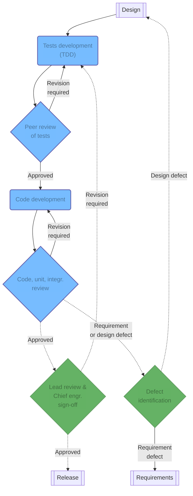

An engineer will start by writing all of the tests needed to confirm the correct implementation of a new feature, without writing any code for these tests to succeed. The quality and coverage of the tests with regards to the feature being developed will be reviewed iteratively until approval. Once the tests have been approved, the developer may start writing the code for these tests to pass.

## Continuous integration and testing

**Continuous testing is an extremely important step for the product to work like a well-oiled machine**: fixing bugs _once_ discovered often means that something has failed in production, causing delays, financial overruns, or even injuries in the case of hardware.

All code pushed to version control shall be continuously tested using CI features of the version control platform.  Such tests include checking that the code is consistent with the chosen style-guide, running various static analysis tests, and ensuring that the code is safely using memory and other resources. This is not an exhaustive list of tests. Each continuous testing process should be both flexible and extensible.

## Test development

Upon the completion of the design, engineers will develop tests on the interfaces with mock implementations[^1] if needed, and the tests will fail on first push. Reviewers will review the concept of the tests and make sure that it adheres to the test plans developed during the requirement stage.

## Code development

Once the tests have been approved, the engineer may start working on the code for these tests to succeed. This part of the process may lead to changes in the detailed design since the implementation in the actual code may show some limitations of the API definition. If minor design changes are needed, the detailed design ought to be updated to reflect that. If major design changes are needed, these must be raised and reviewed by the lead for further action so as to account for all of the potential affects on the system. Moreover, a TTD approach _does not_ encompass all of the possible tests a thoroughly tested piece of code may require. The engineer in charge of this work must write additional tests as the development process is ongoing.

## Reviews

Once the code is ready for review by a peer, it may either be approved for review by the lead, or some major other changes need to be discussed. In the former case, 

[^1]: The purpose of a _mock implementation_ is to provide a dummy example of how a system that isn't available at testing ought to be responding to an API call. For a thorough example, read the [gMock](https://google.github.io/googletest/gmock_for_dummies.html) Google Test documentation.

*[CI]: Continuous Integration
*[TDD]: Test Driven Development