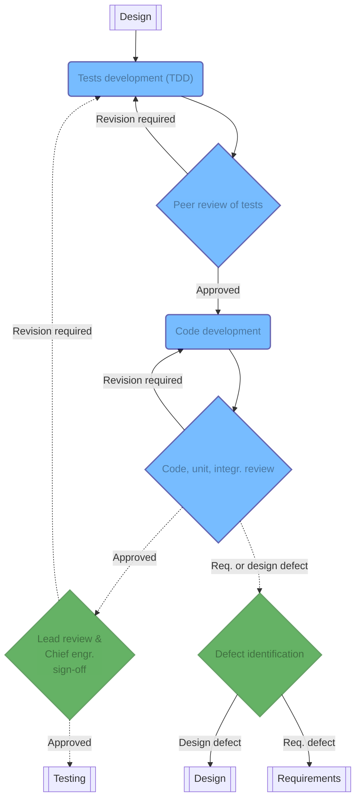

## Tests development

!!! attention
    All code pushed to version control shall be continuously tested using CI features of the version control platform.  Such tests include checking that the code is consistent with the chosen style-guide, running various static analysis tests, and ensuring that the code is safely using memory and other resources. This is not an exhaustive list of tests Each continuous testing process should be both flexible and extensible. **Continuous testing is an extremely important step for the product to work like a well-oiled machine**: fixing bugs _once_ discovered often means that something has failed in production, causing delays, financial overruns, or even injuries in the case of hardware.

An engineer will start by writing all of the tests needed to confirm the correct implementation of a new feature, without writing any code for these tests to succeed. The quality and coverage of the tests with regards to the feature being developed will be reviewed iteratively until approval. Once the tests have been approved, the developer may start writing the code for these tests to pass.

## Code development

*[CI]: Continuous Integration