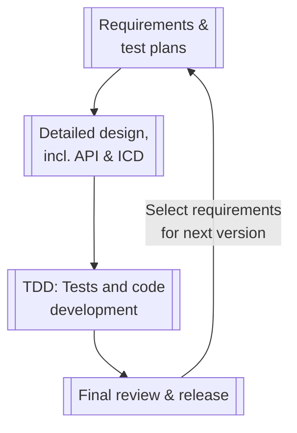
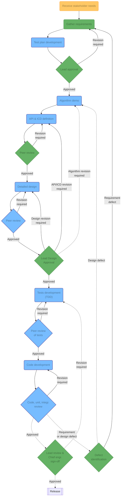

This process is heavily inspired by agile software development with a twist to accommodate space-related software. **For each version of the software, a number of requirements are chosen are these are worked until the next version is released.**

The overall quality assurance process can be broken down into these procedures. Click on the relevant sections in the table of contents to read the detail of each procedure. Note that a dotted line means it's an asynchronous process, freeing engineers to work on another task.

The full process diagram is below.

