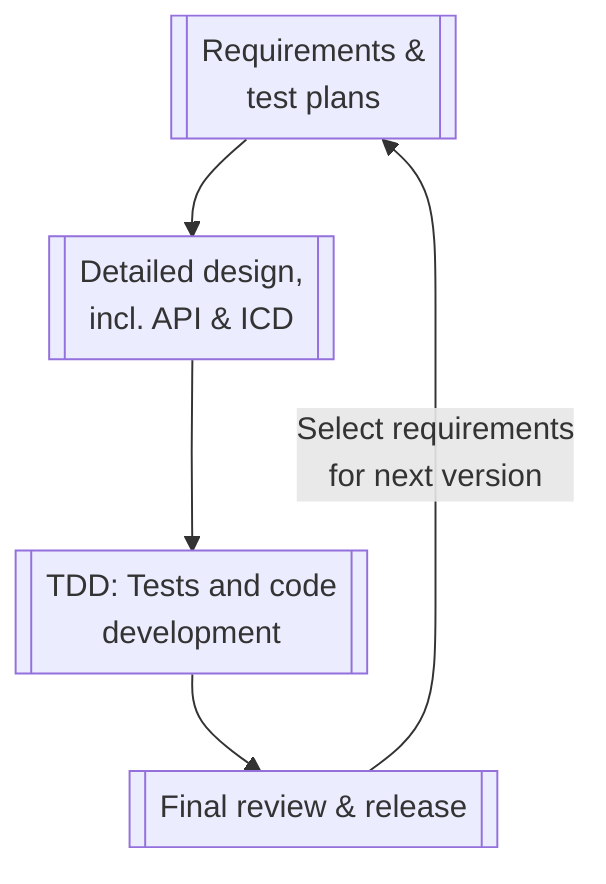
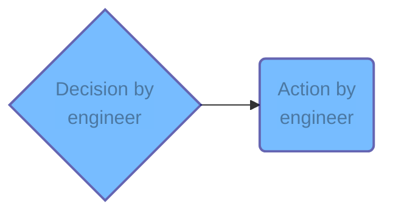
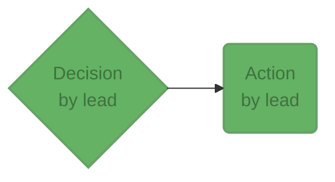
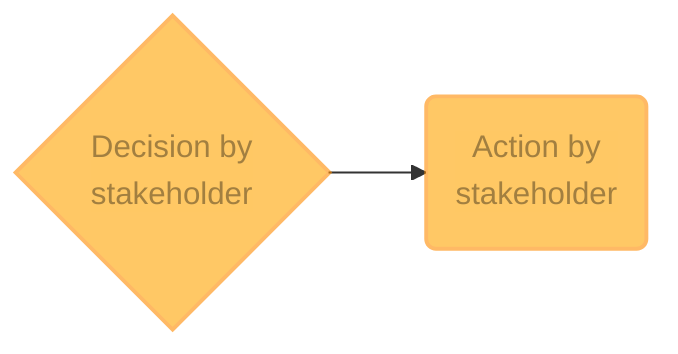

This process is heavily inspired by agile software development with a twist to accommodate space-related software. **For each version of the software, a number of requirements are chosen are these are worked until the next version is released.**

The overall quality assurance process can be broken down into these procedures. Click on the relevant sections in the table of contents to read the detail of each procedure. Note that a dotted line means it's an asynchronous process, enabling engineers to work on another task.

## Legend

### Engineer

An action or a decision performed by an engineer is highlighted in blue.

### Lead or chief engineer

An action or a decision performed by the team lead or the chief engineer is highlighted in green.

### Stakeholder

An action or a decision performed by a stakeholder is highlighted in orange.

