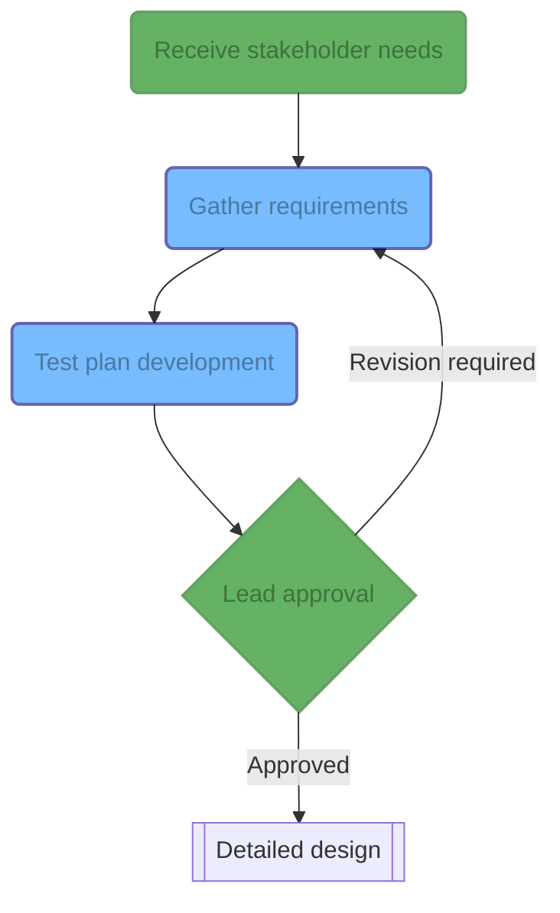

The requirements process is dependent on the objectives and therefore determined on a per-project basis. Yet, the following general process still applies:

1. Engineers define requirements with the help of stakeholders.
2. Leads review these requirements, and iterate with engineers and other stakeholders as needed until each requirement is approved.
3. Test plans for each requirement is designed at the same time as requirements are defined: if a requirement cannot be tested, it isn't a requirement.

The Lead, the stakeholders and the program schedule will determine which requirements fit in which version, and each version guides the development cycle. **As such, requirements shall be decomposed into small enough work units to allow for iterative development.**
