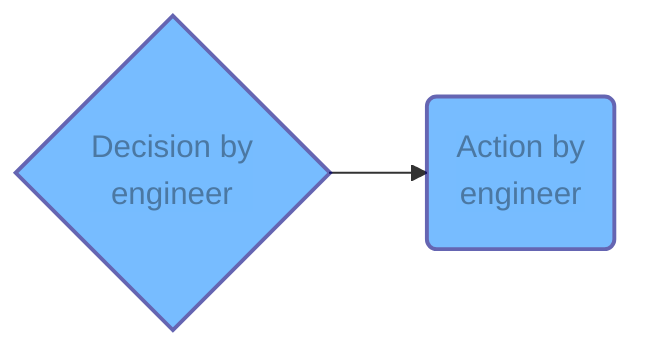
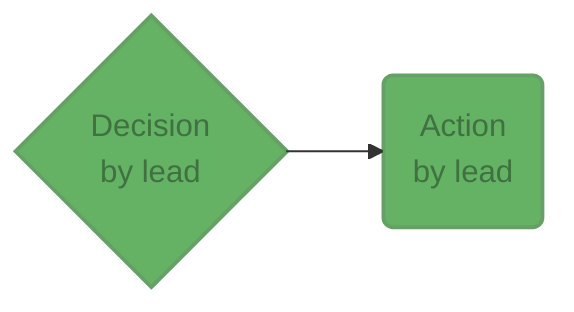
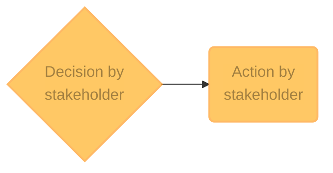

## Importance
Roles and responsibilities are crucial to any GNC or FSW process. If team members don't know what is expected of them, they cannot fulfill their responsibilities adequately.

Each team member must be assigned one of the following roles upon joining a project. For smaller projects, a single person may fulfill several or all roles as long as they still perform all of the reviews adequately and with a critical eye.

## Engineer
Engineers focus on design and implementation.

An action or a decision performed by an engineer is highlighted in blue.

## Lead
A team member, e.g. GNC Lead, responsible for sign-off on an accepted version of the product and for determining which standards apply to each project. The lead is an active participant in the development of the project. That person acts as a tie-breaker for engineering decisions. The lead is encouraged to seek the opinion of engineers on the project. If the lead is in the role of an engineer for a given requirement, they may elect another engineer to act as lead for the review of their work.

An action or a decision performed by the team lead or the chief engineer is highlighted in green.

## Chief engineer
If possible, the Chief Engineer should be independent from the development process and their sole responsibility is tracing and documenting each step of the process to ensure that the project complies with QA policy at specific decision points. This role ensures independence in the QA.

## Stakeholder
Parties who are impacted by the project, whether within the same organization or not. They provide input based on some specific understanding of the project objectives. 

An action or a decision performed by a stakeholder is highlighted in orange.

*[GNC]: Guidance, Navigation, and Control
*[FSW]: Flight Software
*[QA]: Quality Assurance